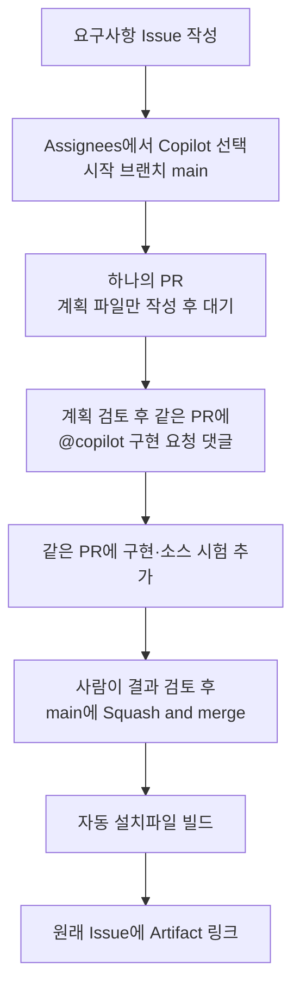

# judicial-sdlc — 업무 자동화 빌딩 블록

**Issue에서 Copilot에 Assign하고, 같은 PR에서 계획 확인과 구현을 이어가는
데스크톱 템플릿**입니다. 최종 코드를 사람이 Squash merge하면 설치파일을 빌드합니다.
완성된 시나리오·판례번호 파서·전용 화면은 없습니다. 복제한 시나리오 저장소에서
요구사항에 맞춰 작성합니다.

**판례 인용·모의 판결 조회 실습:** [instruction.md](instruction.md) —
템플릿 복사부터 Issue 각 칸의 요청문, 같은 PR의 계획·구현, 설치파일 다운로드와 시연까지.
실제 로그인·API 명세는 확인하지 못해 임의로 구성했으며 모의 결과는 실제 판례 검증이 아닙니다.

**개발·GitHub 시험에는 가상 자료만 사용하고, 실제 PDF는 허가된 PC에서 로컬로만 처리합니다.**
일반 PDF를 선택할 수 있으며 앱 생성 파일이나 합성 표시를 요구하지 않습니다.
실제 PDF·익명화한 사건자료·개인정보·계정·토큰·내부 URL을 Git, Issue, PR, 댓글,
Actions 로그, Agent 대화에 넣지 마세요. 생성한 PDF·OCR 모델·설치파일도 Git에 올리지 않습니다.

## 복사 후 준비 — GitHub UI

**전용 PAT, Copilot 작업 시작 API, 자동화 활성화 변수는 필요 없습니다.**
Assign과 `@copilot` 댓글은 로그인한 사용자가 GitHub 기본 기능으로 수행합니다.
이 템플릿 때문에 Copilot Business/Enterprise 작업 API 자격을 추가로 요구하지 않습니다.
계정의 cloud agent 이용 권한과 저장소/조직 정책은 충족해야 합니다.

1. 원본에서 **Use this template → Create a new repository**로 **Private** 복사본을
   만듭니다. Include all branches는 선택하지 않습니다. 원본에서 시나리오를 작업하지 마세요.
2. 복사본의 **Settings → Actions → General**에서 Actions와 GitHub의
   `actions/checkout`, `actions/setup-python`, `actions/upload-artifact` 및
   저장소 내부 reusable workflow 사용이 허용돼 있는지 확인합니다.
3. **Settings → General → Pull Requests**에서 **Allow squash merging**을 켭니다.
   혼동을 막으려면 Allow merge commits / Allow rebase merging은 끕니다.
4. 참가자에게 저장소 쓰기 권한과 cloud agent 사용 권한이 있는지 확인합니다.
   조직 정책상 제한된 항목은 관리자에게 확인합니다.

**Actions의 “Allow GitHub Actions to create and approve pull requests”는 이
템플릿을 위해 켤 필요가 없습니다.** workflow는 PR을 만들거나 승인·병합하지 않습니다.
기본 token 권한은 Read 상태로 유지할 수 있습니다. 빌드 결과 댓글용 `issues: write`는
알림 job에만, 나머지 필요한 권한은 각 workflow에 지정했습니다.

운영 배포에는 `main` 보호를 권장합니다. UI의 **Settings → Branches → Add classic
branch protection rule**에서 `main`, **Require a pull request before merging**,
**Require status checks to pass before merging**을 선택하고 `test`, `scope`를 필수로
지정합니다. 새 저장소에서 `scope`가 안 보이면 첫 PR에 검사가 생성된 뒤 추가합니다.
조직의 추가 리뷰 정책도 따릅니다. 보호 기능의 요금제 제한을 피하려고 공개로 전환하지 마세요.
보호 기능 없는 개인 실습에서는 **사람이 두 검사 성공과 변경 범위를 직접 확인**해야 합니다.
빌드 직전 검사는 잘못 병합된 소스를 main에서 되돌려 주지 않습니다.

예전 API 연계 버전에서 복사한 저장소의 secret·변수·권한은 소스 업데이트로 자동 삭제되지
않습니다. 이 버전은 전용 토큰이나 활성화 변수를 읽지 않습니다. 더 이상 쓰지 않는 토큰은
발급자가 폐기하고 저장소 secret을 정리하세요. 이 안내 자체가 설정을 변경하지는 않습니다.

### Cloud Agent의 OCR 실행 환경

기본 브랜치의 `copilot-setup-steps.yml`은 Agent 작업 전에 고정 버전 CPU PyTorch·
전체 OCR 의존성·검증된 모델·한국어 글꼴·Xvfb를 준비하고 공통 오프라인 OCR을 확인합니다.
일반 `CI`는 계속 가벼운 텍스트 의존성만 사용합니다. 준비 단계의 공통 OCR 성공은
시나리오 구현 완료를 뜻하지 않으며, 설치파일을 만들거나 실행하지도 않습니다.
Copilot 설정의 `timeout-minutes`는 지원 상한인 59분입니다. 실제 Agent 실행 로그의
적용 시간을 확인하며, 별도 Windows 설치파일 빌드의 60분 제한과 구분합니다.

준비 설정 변경은 별도 공통 유지보수로 원본과 기존 복사본의 `main`에 반영하고,
진행 중인 PR에도 기반 변경을 동기화합니다. **Actions → Copilot Setup Steps → Run workflow**
에서 `main`의 준비 성공을 확인한 뒤 다음 Agent 실행을 시작하세요.
이미 실행 중인 환경은 갱신되지 않습니다. 설치·다운로드 실패 시 Agent가 시작되더라도
OCR 준비 완료로 보지 말고 원인을 해결해야 합니다. 방화벽을 해제하거나 비공식 미러로
우회하지 않으며, 사전 준비에서도 공식 호스트 접근이 실패하면 승인된 실행 환경이 필요합니다.

Linux Agent의 GUI 시험은 명령마다 `xvfb-run -a`로 실행합니다.
구현 완료 전에는 아래 Unit → E2E 명령을 순서대로 실행해
시나리오의 실제 OCR·화면·저장 경로를 확인합니다.

## 사용 순서 — 같은 PR에서 계획과 구현



1. **Issues → New issue → 업무 자동화 요청**에서 입력·출력·완료 조건·예외를 작성합니다.
2. Issue의 **Assignees → Copilot**을 선택합니다. 대상은 현재 복사본, 시작 브랜치는
   **main**입니다. **Optional prompt는 비워도 됩니다.** 저장소 지침이 계획부터
   작성하도록 합니다. Issue 생성만으로 Agent가 자동 시작되지는 않습니다.
3. Copilot이 만든 PR에서 `plans/<실제 Issue 번호>.json`만 변경됐는지 보고 계획을
   검토합니다. **계획 단계에서는 병합하지 않습니다.**
4. 계획이 맞으면 **그 PR의 Conversation**에 아래 댓글을 남깁니다.

   ```text
   @copilot 계획을 확인했습니다. 이 계획대로 같은 PR에서 구현해주세요.
   계획 파일은 그대로 유지하고, 공통 모듈·의존성·설치 도구는 변경하지 마세요.
   소스 시험 후 검토를 기다리고, 직접 병합하거나 EXE를 실행하지 마세요.
   ```

5. 같은 PR에 구현이 추가되면 변경 내용과 `test`·`scope` 성공을 확인합니다.
   Draft라면 **Ready for review**로 바꾸고, 완료된 구현을 **Squash and merge**합니다.
   계획과 구현이 함께 하나의 커밋으로 main에 남습니다.
6. main 소스 CI 뒤 **Accepted PR to installer**가 정확한 병합 커밋으로 설치파일을
   만듭니다. 원래 Issue에 게시된 Artifact 링크에서 ZIP을 내려받습니다.

GitHub가 **Approve workflows to run**을 요구하면 사람이 내용을 확인한 뒤 허용합니다.
토큰·권한을 넓히거나 플랫폼 실행 승인을 우회하지 않습니다.
계획 수정을 원하면 같은 PR에 댓글로 수정 요청하고, 다시 확인한 뒤 구현을 요청하세요.
계획 승인 댓글의 의미와 시점은 **사람과 Agent 지침이 관리**하며 자동 인증하지 않습니다.
기계적으로 확인하는 것은 최종 소스 범위·계획 JSON·CI·사람의 실제 squash 병합입니다.
자세한 범위와 실패 처리는 [workflow 안내](docs/workflow.rst)를 참고하세요.

### 병합 후 수정 — 새 계획 없이 같은 업무 이어가기

최초 구현을 병합한 뒤 생긴 문제는 **Fix with Copilot → 수정 PR → 검사 → Squash merge
→ 재빌드**로 처리합니다. 같은 업무의 수정이라면 새 Issue나 계획 파일을 만들지 않습니다.
main의 기존 계획이 하나면 자동 연결합니다. 여러 개면 수정 PR 본문에 독립된 한 줄
`Refs #N`으로 기존 요구사항 Issue를 지정하며, 기존 계획은 변경하지 않습니다.
새 업무 범위는 기존의 계획 절차를 거치고, 공통 모듈·빌드 설정 수정은 별도 유지보수입니다.
검사 기준 변경은 명시적으로 검토하며 사람의 병합·정확한 소스 확인·Windows 수용 시험은
그대로 유지합니다. 결과 링크는 기존 Issue에 남습니다.
공통 main이 먼저 갱신됐다면 수정 브랜치에 main을 동기화하고 최신 검사를 실행합니다.

**`CI`는 구현 변경이 들어간 PR과 `main` 병합 후에 실행합니다.** PR 변경이
`plans/` 안의 파일뿐이면 소스 CI는 생략하고 `Trusted PR scope`로 범위·계획 형식만
확인합니다. 필수 검사 `test`가 계획 단계에서 대기 상태여도 실행을 강제로 시작할
필요는 없습니다. 같은 PR에 구현 변경이 추가되면 CI가 실행됩니다.
계획 파일과 코드가 함께 바뀌는 PR도 생략하지 않습니다.

구현 검토에서는 시험 통과 개수만 보지 않고 **실제 생성 입력의 누락 여부,
원문이 화면에서 읽히는지, OCR 신뢰도가 저장 결과에도 남는지**를 확인합니다.
Windows 빌드는 **Unit tests → E2E tests**로 나눠 실행합니다.
Unit에서 실제 통과한 앱 시험은 E2E에서 반복하지 않습니다. E2E는
`RuntimeAcceptanceTests`와 Unit에서 통과하지 않은 나머지 앱 시험을 실행합니다.
다른 클래스에서 의존성 때문에 skip된 시험도 E2E에서 실행하므로 누락되지 않습니다.
E2E의 누락·실패·skip·expected-failure는 패키징을 막습니다.
이는 소스 앱 시험이지 설치 EXE 실행은 아닙니다.
패키징 후에는 EXE 내장 아카이브의 `torch.testing`·`torch.nn` 등 OCR 필수 모듈도
검사해 누락되면 Setup 제작을 막습니다. `frozen-ocr-audit.json`은 모듈 포함 여부의
기록이며, DLL 로딩과 포장된 앱의 실제 OCR은 승인된 Windows PC에서 별도로 확인해야 합니다.

```bash
python .github/scripts/runtime_check.py --phase unit
python .github/scripts/runtime_check.py --phase e2e
```

Linux의 GUI 없는 환경에서는 두 명령 모두 앞에 `xvfb-run -a`를 붙입니다.
Unit 성공 기록은 `.test-results/unit.json`에 저장하며 Git에는 포함하지 않습니다.
기록의 소스·시험 목록·실행 환경·Actions 실행/작업이 일치할 때만 중복을 제외합니다.
코드를 고쳤거나 기록이 없으면 Unit부터 다시 실행합니다. 이 기록은 중복 방지용이지 승인 증명이 아닙니다.
실제 OCR 입력 조합은 유지되므로 중복 Unit 제거가 OCR 처리시간 자체를 줄이지는 않습니다.

OCR 이미지의 처리 범위는 렌더링 320만 픽셀·한 변 2200픽셀, CRAFT canvas 1536입니다.
가상 서면은 A4 595×842pt로 만들며 글자를 자르거나 용지를 키우지 않습니다.
한도를 넘는 이미지 페이지는 명확한 오류로 중단하고 일부 결과를 전체 성공으로 표시하지 않습니다.
문자 인식과 원문 대조는 원래 렌더링 해상도·좌표를 유지합니다.
이 제한은 메모리 사용량 보장이나 시연 PC의 최소 사양 인증이 아닙니다.

## 구조와 수정 위치

```text
modules/                    준비된 공통 부품
  ocr/                      PDF 읽기·CRAFT/KLOCR·모델 준비·모듈 의존성
  precedent/                모의 로그인·검색
  slm/                      고정 응답의 모의 문구 비교
  transport.py              로컬 HTTP 통신
  diagnostics.py            문서 내용 없는 로컬 오류 위치 기록
mock_server/                모의 서비스와 가상 API 응답
app/
  gui.py                    최소 입력·실행·결과·저장 화면
  pipeline.py               모듈 조합과 transform_pages 맞춤 함수
packaging/                  Python·OCR·앱 폴더 구성과 설치파일 제작
.github/                    단일 Issue 폼·Skill·소스/범위/빌드 workflow
tests/                      공통 부품 시험과 중립적인 합성 OCR 입력
docs/                       모듈·진행·배포·자료 정책
run.py                      기본 앱 시작점
requirements.txt            모듈별 런타임 의존성 통합 진입점
```

Python은 실행환경이며 별도 업무 모듈이 아닙니다. 모든 부품은 **같은 저장소**에 있고
일반 Python 함수로 연결합니다. 기본 앱은 글자 표시만 하며 검색·SLM을 자동 호출하지
않습니다. 필요한 맞춤 함수·화면·합성 입력 생성기는 `app/`에 작성합니다.
검색·SLM은 loopback HTTP mock이며 실제 법원 API나 생성형 AI 추론이 아닙니다.
복사본의 `app/`에서 가상 원문을 정의하고 `running_server(sources=...)`에 전달하면
기존 모의 로그인·조회 함수를 그대로 사용할 수 있습니다. 번호별 가상 판결을 원본
템플릿에 고정하지 않고, 업무별 자료와 화면·조합은 복사본에서 만듭니다.
맞춤 sources 세션은 검색 전용이며 SLM 의미 비교·RAG는 수행하지 않습니다.
[모듈 사용법](docs/modules.rst)과 [조합 Skill](.github/skills/compose-workflow/SKILL.md)을 참고하세요.

### 추출 원문을 먼저 확인

기본 화면은 **1. 추출 원문 → 2. 처리 결과** 탭 순서입니다. PDF 읽기/OCR이 끝나면
업무별 처리가 끝나기 전에도 원문 탭에서 모든 읽힌 페이지를 선택할 수 있습니다.
이곳의 본문은 읽기 모듈이 반환한 텍스트이며 공백·줄바꿈·오인식을 자동 교정하거나
요약하지 않습니다. 읽기 방법과 경고는 본문과 분리해 보여주고, 긴 행은 가로로 스크롤합니다.
PDF 쪽 번호는 인쇄 쪽번호와 구분합니다. 원본 PDF 이미지나 정확성 인증 화면은 아닙니다.

업무별 선별·가공이 원문을 덮어쓰지 않도록 처리 전 복사본을 보존하며 탭/쪽 전환으로
OCR을 다시 실행하지 않습니다. 업무 처리만 실패하면 읽기 완료 원문은 남기되 결과 저장은
막습니다. 입력 변경·새 실행·읽기 실패 시에는 이전 원문과 결과를 모두 비웁니다.
결과 JSON의 기존 형식은 유지합니다. 처리 결과에서 원문을 제외하는 시나리오가 원문 저장도
필요하다면 별도로 명시해야 합니다. 이 변경은 새 템플릿 복사본에 적용되며 기존 시나리오
저장소나 이미 배포한 EXE를 자동 갱신하지 않습니다.

## 로컬 개발·OCR

Python 3.12와 Tkinter를 사용합니다. 다음은 개발자용 명령이며 참가자가 실행할 필요는 없습니다.

```bash
python -m venv .venv
# Windows: .venv\Scripts\activate
# macOS/Linux: source .venv/bin/activate
python -m pip install -r modules/ocr/requirements-text.txt
python run.py
python -m tests.ocr_fixtures --text local/synthetic.pdf
```

실제 OCR은 **CRAFT 영역 검출 + KLOCR 한국어/영어 문자 인식**이며 CPU로 실행합니다.
EasyOCR는 CRAFT 검출에만 사용하고 이전 korean_g2 인식기는 사용하지 않습니다.
Windows/Linux에서는 CPU PyTorch를 먼저 설치합니다.
일반 로컬 PDF는 50MB·100페이지까지 읽습니다. 암호화·주석/양식은 지원하지 않으며,
이미지 렌더링 크기와 페이지당 텍스트 한도는 유지합니다.
합성 자료만 허용하는 개발 시험에서는 `read_document(path, synthetic_only=True)`를
명시할 수 있지만 기본 앱은 합성 표시를 검사하지 않습니다.

```bash
python -m pip install torch==2.8.0 torchvision==0.23.0 --index-url https://download.pytorch.org/whl/cpu
python -m pip install -r requirements.txt
python modules/ocr/prepare.py
python -m tests.ocr_check
python .github/scripts/runtime_check.py --phase unit
python .github/scripts/runtime_check.py --phase e2e
```

macOS는 CPU wheel 설치 명령을 제외하고 진행합니다. 스캔 입력은
`python -m tests.ocr_fixtures --scan local/synthetic-scan.pdf`로 생성합니다.
OS에 한국어 글꼴이 필요하며 글꼴은 재배포하지 않습니다. 이 입력은 공통 OCR 시험용이지
완성된 시나리오가 아닙니다. 모델은 준비/빌드 시에만 다운로드하고 런타임에는 내려받지
않습니다. OCR 원문·출처·경고를 보존하며, 다단·표 읽기 순서나 인쇄 줄번호는 보장하지 않습니다.

모델·설정·토크나이저는 고정 리비전과 SHA-256으로 검증한 ``assets/klocr/``에서만
읽습니다. 실행 중 다운로드·외부 모델 호출은 하지 않습니다. ``method``는 ``klocr``이며,
신뢰도는 비보정 토큰 확률 지표이지 문자 정확도를 보장하는 수치가 아닙니다.
검출 영역의 빈 인식·생성 길이 제한도 경고와 함께 보존하므로 사람이 원문을 확인해야 합니다.

**라이선스:** KLOCR 가중치는 **CC BY-NC-SA 4.0**(비상업·동일조건변경허락)입니다.
코드 라이선스나 기본 모델의 Apache 라이선스와 혼동하지 마세요.
기관 사용·워크숍·설치파일 재배포 전에 적용 조건을 검토해야 하며,
이 템플릿은 무제한 상업 이용이나 배포 허가를 제공하지 않습니다.
출처 모델 카드와 제3자 라이선스는 설치 payload와 고지에 포함합니다.

### PC 사양과 실습 분량

GPU는 사용하지 않지만 CPU OCR의 메모리·시간 부담은 작다고 보장하지 않습니다.
기존 시나리오의 Mac M5/32GiB 소스 실행에서 5쪽 스캔은 61~75초,
최대 프로세스 RSS 약 12.6GiB를 기록했습니다. GUI·Windows EXE를 포함한 수치가
아니며 이 템플릿 복사본의 최소 사양으로 사용할 수 없습니다. 시연 PC에서 따로 측정하세요.
설치파일 크기는 실행 중 RAM 요구량과 다릅니다.

매 빌드의 대표 OCR 입력은 3~5쪽, 장문 텍스트는 53쪽으로 구분합니다.
전체 53쪽 스캔·혼합은 별도 장시간 시험이며 축소 시험 성공으로 대체했다고 하지 않습니다.
진행 로그·UTF-8·예상 밖 GUI 대화상자 처리를 포함한 요청문은 `instruction.md`에 있습니다.

## 배포

배포용 EXE는 **`workflow-setup.exe` 하나**입니다. PyInstaller onedir와 Inno Setup으로
Python·OCR·앱을 고정 Program Files 폴더에 설치합니다. 설치 후에는 `workflow-app.exe`와
`_internal/`의 DLL·모델 파일이 함께 필요합니다. 모듈별 EXE를 호출하지 않습니다.
**앱은 `--windowed`로 제작하므로 별도 터미널 창을 띄우지 않습니다.**
예상치 못한 Python 오류는 팝업과 사용자별 로컬 진단 로그로 안내합니다.
Windows 로그 위치는 `%LOCALAPPDATA%\Judicial-SDLC\<앱 식별값>\application.log`이며
오류 종류·코드 파일명/줄 번호만 기록합니다. 문서 본문·입력 파일 경로·예외 메시지·
계정 정보를 기록하지 않고, 256KiB마다 이전 로그 한 개만 보관합니다.
로그 저장 실패도 팝업에 표시합니다. Python 시작 전 DLL 로딩 오류는 이 로그에
남지 않을 수 있으므로 실제 설치 PC의 실행 확인은 여전히 필요합니다.
관리자 권한과 기관 허가가 필요하며 **WDAC 허용을 보장하지 않습니다.**
보안 정책·기존 Python/OCR을 변경하거나 설치 후 앱을 자동 실행하지 않습니다.
설치파일 자체는 설치 중 임시 파일을 쓸 수 있습니다.

Artifact 보관은 14일입니다. 소스에 EXE를 커밋하거나 Release·메일·자동 업데이트를
추가하지 않습니다. 제작 과정에서는 생성된 EXE/설치파일을 실행하거나 최종 바이너리
정적 분석하지 않습니다. 자세한 내용은 [배포 안내](docs/release.rst)에 있습니다.

원본 템플릿만 단일 루트 커밋을 유지하고, 시나리오 저장소는 완료된 작업의 squash
커밋을 누적합니다. 원본 수정은 기존 복사본에 자동 반영되지 않습니다.
실제 자료의 외부 업로드 금지와 로컬 처리 범위는 [자료 정책](docs/privacy.rst)을 따르세요.

공식 UI 안내: [템플릿 복사](https://docs.github.com/en/repositories/creating-and-managing-repositories/creating-a-repository-from-a-template),
[Copilot 배정·PR 댓글](https://docs.github.com/en/copilot/how-tos/use-copilot-agents/cloud-agent/use-cloud-agent-on-github),
[브랜치 보호](https://docs.github.com/en/repositories/configuring-branches-and-merges-in-your-repository/managing-protected-branches/managing-a-branch-protection-rule).
